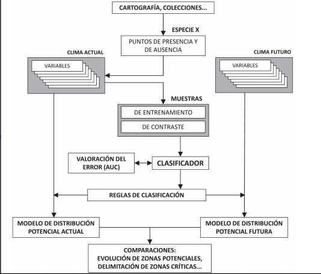
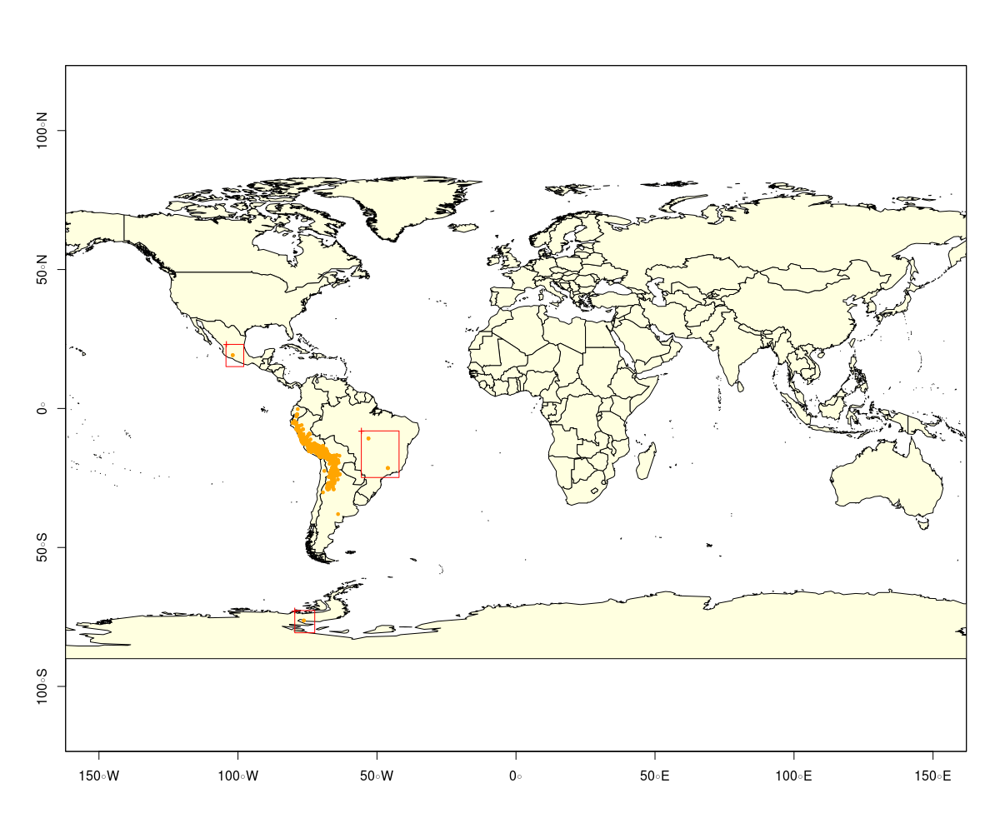

```{r setup, include=FALSE}
knitr::opts_chunk$set(echo = TRUE, 
                      message = FALSE, 
                      warning = FALSE)

library(tidyverse)
```


# Qué son los modelos de distribución de especies??

Los modelos de distribución de especies son represetaciones cartográficas de la idoneidad de un espacio para la presencia de una especie en función de las variables empleadas para generar dicha
representación [@mateo].

La idioneidad no es mas que la relación matemática entre la distribucion real y unas varibles independientes que suelen ser topográficas, ambientales y geológicas.

 La variable dependiente es dicotómica (presencia/ausencia) y las independientes pueden ser cuantitativas (e.g., temperatura o elevación) o nominales (e.g., litología o uso del suelo).
 
# Pasos para la construcción de los modelos



Los datos conocidos sobre la distribucion de la especies se realacionan con los datos disponibles, si existe la realación se extrapola, comunmente la interperetación es erronea, pues se toma como la probabilidad de la especie en un punto, realmente es la similitud del lugar según las variables utilizadas (ej. condiciónes ambientales) 

# Iterpretaciónes de los modelos 

+ Modelos de idioneidad: Representa la distribución potencial de la especie

+ Modelos del habitat potencial: El concepto puede aplicarse a la decripción de la asociación entre los organismos y las condiciónes ambientales.

+ Modelos del nicho ecológico: La combinación de condiones ambientales que una especie puede tolerar.

# Variables dependientes

Generalmenete se cuentan con datos de precensia, pocas veces con datos de ausencia y casi nunca cpn datos de abundancias.

# Variables Independientes

Son los datos climaticos, son buenos para determinar el patron general de la distribución de una especie a escalas grandes,sin embargo, a una escala mas reducida las causas de distribución puede ser atribuida la distribución de rescursos y a condiciónes microtopográficas en el ambiente; las variabes cambian según el objetivo, en todo caso es recomendable que tengan estas tres condiciónes:

+ Relación potencial con la especie (explicativa).
+ Variación significativa en el sitio.
+ Sean independientes o con muy poca correlación.

# Métodos de modelación

* Tecnicas discriminantes: datos de ausecia y precencia (GAM, glm, Redes neuronales....)
* Tecnicas Descripitvias: datos de presencia
* Tecnicas mixtas: Utilzan varias reglas tanto descriptivas como discriminantes "modelos de concenso"

# Preparacón de datos 

En la mayoría de los casos, tendrá un archivo con datos de localidad de puntos que representan la distribución conocida de una especie.

```{r}
library(dismo)

file<- paste0(system.file(package = "dismo"), "/ex/bradypus.csv")

datasp<- read_csv(file)
```

Importante: las coordenadas deben estar en longitud-latitud

```{r}
# Variable Dependiente
datasp<- datasp %>% dplyr::select(lon, lat)
```

## Datos de distribución de especies del Global Biodiversity Inventory Facility (GBIF)

```{r}
#datad<- gbif("solanum", "acaule*", geo = TRUE)

#save(datad, file = "datad.Rdata")

load("datad.Rdata")

datad<- datad %>% filter(lat != "NA" & lon != "NA")


library(maptools)
data(wrld_simpl)

plot(wrld_simpl, xlim=c(-80,70), ylim=c(-60,60), axes=TRUE, col="light yellow")
box()
points(datad$lon, datad$lat, col='orange', pch=20, cex=0.75)

```


## Depurar los datos

Tener en cuenta la distribución de especie, en este caso `Solanum acaule` es una especie que se encuentra en las partes más altas de las montañas de los Andes del sur de Perú, Bolivia y el norte de Argentina.

```{r, eval= FALSE}
datap<- datad %>% dplyr::select(c(country, acceptedScientificName, lon, lat))
# Hice el filtro anterior para que no mostrara las columnas completas

coordinates(datap)<- ~lon+lat
raster(datap)
# Este modo se pueden encontrar las anomalias, no encontré en Rmarkdown como hacer para que corriera, se puede copiar en un script para que pueda depurar....
filas<- tibble()
plot(wrld_simpl, xlim=c(-150,150), ylim=c(-80,80), axes=TRUE, col="light yellow")
points(datap$lon, datap$lat, col='orange', pch=20, cex=0.75)
a= row.names(click(datap, n= Inf))
filas<- rbind(filas, a)

```




```{r}
load("filas.Rdata")

datad<- datad %>% slice(-as.numeric(c(filas$x)))
```


## Comprobación cruzada

Verificar que los puntos si estan dentro de los poligonos de los paises

```{r}
coordinates(datad)<- ~lon+lat
crs(datad) <- crs(wrld_simpl)

#class(datad)

ovr<- over(datad, wrld_simpl) # Contiene para cada punto, el registro correspondiente de wrld_simpl

ovr<- ovr$NAME

i<- which(ovr != datad$country)

#r<- raster(datad)

#plot(r)
#click(r)

plot(datad)
plot(wrld_simpl, add=T, border='blue', lwd=2)
points(datad[i, ], col='red', pch=20, cex=2)
#click(r)
```


# Datos Ambientales (variables independientes)

Estas variables generalmenete se presentan en archivos raster, pueden incluir clima, suelo, terreno, vegetación, uso del suelo y otras.


```{r}
path <- file.path(system.file(package="dismo"), 'ex')
capas <- list.files(path, pattern='grd$', full.names=TRUE )
```

El `$` signo indica que los archivos deben terminar con los caracteres 'grd'. Al usar `full.names=TRUE`, se vuelven a ajustar los nombres de ruta completos.

```{r}
conjunto<- stack(capas) # Unir capas
plot(conjunto)
```


```{r}
plot(conjunto, 1)
plot(wrld_simpl, add= TRUE)
points(datasp, col= "red")
```

## Extraer valores 

Se extraen los valores de predictoras con las respuesta..

```{r}
ocurrencia<- extract(conjunto, datasp)

set.seed(0)
i<- randomPoints(conjunto, 500) # Puntos de fondo (ausencia)

ausencia<- extract(conjunto, i)

ocurrencia<- as.tibble(ocurrencia) %>% mutate(ap= 1)
ausencia<- as.tibble(ausencia) %>% mutate(ap= 0)

conjunto<- rbind(ocurrencia, ausencia) %>% mutate(biome= as.factor(biome), 
                                                  ap= as.factor(ap))

```

```{r, fig.width= 12, fig.height= 10}
library(GGally)
conjunto[, 1:8] %>% ggpairs(., ggplot2::aes(colour= conjunto$ap)) + theme(legend.position = "top")
```


# Ajuste del modelo

El modelo es muy parecido a una formula para r `~` depende del modelo que se vaya a emplear hay unos que emplean datos de ausencia y presencia `glm` y otros solo de presencia `bioclim` del paquete `dismo`, para este caso se utiliza `conjunto` y `presencia` data..

```{r}

conjunto<- conjunto %>% mutate(ap= as.numeric(as.character(ap)))
model<- glm(ap ~ bio16 + bio12+ bio5, data=conjunto)

broom::tidy(model)
broom::augment(model)

```


```{r}
modelb<- bioclim(ocurrencia[,c("bio16", "bio12", "bio5")])

pairs(modelb)
ggpairs(ocurrencia[,c("bio16", "bio12", "bio5")])
```

# Prediccón del modelo

```{r, eval=FALSE}
conjunto

names(conjunto)

i<- predict(conjunto, model)

plot(i)
```


