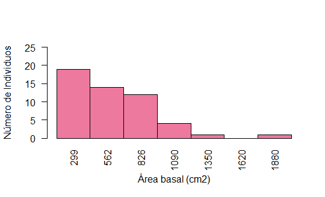
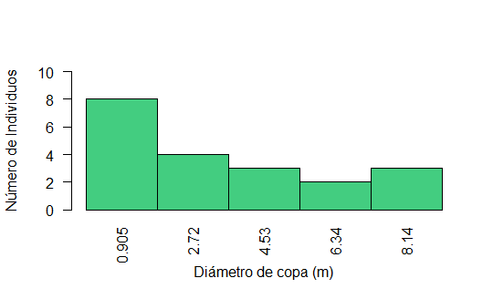

```{r setup, include=FALSE}
knitr::opts_chunk$set(echo = FALSE, 
                      warning = FALSE, 
                      message = FALSE)

library(tidyverse)
library(ggplot2)
library(readxl)
```


# INTRODUCCIÓN 

Se realiza una visita a la estación forestal piedras blancas con el objetivo de aplicar los conocimientos adquiridos teóricamente en lo relacionado a uso de equipos y toma de información relacionada con la estructura del bosque. La información recolectada en las parcelas relacionada con el DAP, altura de los árboles y diámetro de copa (DC);  se usa para realizar comparaciones entre parcelas y además comparar los métodos de medición implementados en la práctica. 

# MATERIALES Y EQUIPOS

+ Forcípula:  Regla graduada que permite medir el diámetro de una superficie circular como el caso de los árboles.
+ Cinta diamétrica: Cinta graduada en pulgadas o centímetros que se usa para medir el diámetro de los árboles
+ Clinómetro:  Medición de la altura de un árbol mediante la medición del ángulo y la respectiva distancia desde donde se toma el ángulo con respecto al fuste del árbol.
+ Hipsómetro:  Instrumento de medición empleado en el cálculo de las alturas de los árboles.


# PROCEDIMIENTO 

En la realización de la práctica se procedió de la siguiente manera: 

Para el levantamiento de las parcelas en campo se seleccionaron al azar 4 parcelas circulares en una plantación de pino Pátula en la reserva forestal de piedras blancas. 

En las parcelas circulares con un área de de $250 m^2$, se procedió a medir el DAP a los individuos que tenían un DAP >= 10  con cinta diamétrica.
Seguidamente dentro de la parcela de $250 m^2$ se procedió a establecer una subparcela de $100 m^2$ en la cual se tomaron las siguientes mediciones: 

Altura total con clinómetro e hipsómetro de los individuos
Diámetro de copa 
DAP con forcípula 
Para obtener el diámetro de copa medio se midió la proyección en dos direcciones, con cinta métrica, el diámetro normal se midió con forcípula en forma cruzada, utilizando el promedio entre las dos mediciones realizadas a cada árbol.  
Posterior a la recolección de información se procedió a realizar los correspondientes cálculos; los resultados de dichos cálculos se relacionan a continuación. 


# RESULTADOS 


## Error en las mediciones

Con la fórmula $(E\% = 100 * \frac{Estimado-Observado}{Observado})$ en valor absoluto, se calculó el porcentaje de error de DAP y altura, tomando los datos del estimado como el DAP con forcípula, y  observado el DAP tomado con cinta diamétrica; para altura estimada se tomó la lectura del hipsómetro y para el valor observado, el que se calculó con el clinómetro.

```{r, results='asis'}
data<- read.csv2("Salida1.csv")

data<- data %>% mutate(Parcela = as.factor(Parcela),
                       Subparcela = as.factor(Subparcela)) %>% select(-c(X.))


data<- data %>% group_by(Parcela) %>% mutate(`Area ind(m)`= (pi/4)*(DAP_cm/100)^2, 
                                             Dap_f_cm = (d1+d2)/2, 
                                             `Area copa(m)` = (pi/4)*(D_copa)^2) %>% 
  mutate(`Error DAP`= ((abs(Dap_f_cm - DAP_cm))/ DAP_cm)*100, 
         `Error alt` = ((abs(Alt_med - Alt_cal))/ Alt_cal)*100) 

data1<- data %>% rename(DAP_obs= DAP_cm, DAP_est= Dap_f_cm, 
                Alt_obs= Alt_cal, Alt_est= Alt_med) %>% select(DAP_obs, DAP_est, Alt_obs, Alt_est,
                                                                       `Error DAP`, `Error alt`) %>% 
  filter(DAP_est != "NA")

```


```{r results = 'asis'}
knitr::kable(data1, caption = "Error de DAP y altura, DAP_obs= DAP tomado con cinta diamétrica, DAP_est= DAP tomado con forcípula, Alt_obs= Altura calculada (con clinómetro) con ángulos y distancia, Alt_est= Altura tomada con hipsómetro.")
```


```{r results='asis'}
knitr::kable(data1 %>% group_by(Parcela)%>% summarise(DAP_obs= mean(DAP_obs), DAP_est= mean(DAP_est), Alt_obs= mean(Alt_obs), Alt_est= mean(Alt_est), `Error DAP`= mean(`Error DAP`), `Error alt`= mean(`Error alt`)), 
             caption = "Error promedio de DAP y altura por Parcela.")
```


```{r results='asis'}
knitr::kable(data %>% group_by(Parcela) %>% 
  summarise(a= sum(`Area ind(m)`), N_ind= length(Parcela),
            Dcm= sqrt(mean(DAP_cm^2))) %>% 
  mutate(`Area basal`= a*10000/250) %>% 
  select(c(Parcela, Dcm, `Area basal`)), 
  caption = "Diámetro cuadrático promedio y área basal por parcela.")


```

```{r results='asis'}
knitr::kable(data %>% group_by(Subparcela) %>% 
  summarise(a= sum(`Area ind(m)`), 
            Dcm= sqrt(mean(DAP_cm^2)),
            Area_copa_p= sum(`Area copa(m)`)/length(Subparcela), 
            Altura_p= sum(Alt_cal)/length(Subparcela)) %>% 
  mutate(`Area basal`= a*10000/100) %>% 
  select(c(Subparcela, Dcm, `Area basal`, Area_copa_p, 
           Altura_p)) %>% slice(-c(1)), 
  caption = "Diámetro cuadrático promedio, área basal,  área de copa promedio y altura promedio por subparcela.")
```


## DISCUSIÓN 

Para las alturas de los individuos se establecieron criterios específicos que permitieran minimizar las variables causales de error, se medían los ángulos con el clinómetro procurando que la distancia horizontal fuera suficiente para que la vista + fuera inferior a 45 grados, adicional a esto desde el mismo punto que se tomaron las alturas con clinómetro se tomaron las alturas con hipsómetro, de tal forma que la variable de distancia fuera constante.


En la **tabla 1** y **2** se observa el porcentaje de error de DAP y de altura para cada individuo de las subparcelas de 0,01 ha. Se puede apreciar que en su mayoría, los errores en la medición del DAP es menor a los porcentajes de error de las alturas. El error en promedio para cada subparcela (1a, 2a, 3a, 4a, respectivamente) en la medida de DAP 1.609329, 2.552089,  1.718945, 4.182051, siendo el error promedio mayor el de la subparcela 4a, y el menor el de la subparcela 1a, esto gracias a que el mayor porcentaje de error pertenece a un individuo de la subparcela 4a, el error promedio de la subparcela 1a es el más bajo debido a la cantidad de datos tomados y su bajo porcentaje de error individual. Para las medias de alturas de las subparcelas (1a, 2a, 3a, 4a) tenemos 3.446756, 4.825732, 3.154843, 2.354912 siendo claramente el porcentaje de error mayor para la subparcela 2a porque el mayor dato de error pertenece a un individuo de esta subparcela, y el menor para la subparcela 4a, debido a la cantidad de datos tomados con un porcentaje de error relativamente bajo para cada individuo.


La **figure 1** muestra la distribución del área basal de todos los individuos dentro de las parcelas, gracias a esta información se puede ver claramente que la mayor concentración de individuos en las primeras marcas de clase , por lo que se puede inferir que el nivel de ocupación de estas parcelas está dado por muchos individuos con poca área basal y solo se muestra un individuo con área basal por encima de los $2000 cm^2$ y pertenece a la parcela 2.


```{r, fig.align= "center",fig.cap= "Distribuciónes área basal", fig.align= "center", out.width="400px", out.height="400px", results='asis'}

``` 

Con respecto al diámetro de copa, en la **Figure 2** se observa que la mayor concentración de individuos presentan un diámetro de copa entre 0 y 1,8 metros, esto debido a que se encuentran en una plantación de pinus patula abandonada, la mayoría de los individuos con los diámetros más grandes se encontraban sin acículas en sus ramas y algunos otros carecían de ramas, esto debido a múltiples razones como pueden ser que por la falta de manejo, por exceso de peso, por la edad del árbol o condiciones climáticas.

```{r, fig.align= "center", out.width="400px", out.height="400px", fig.cap= "Distribuciónes Diametro de copa", results='asis'}

```


```{r, fig.cap= "Distribuciónes DAP", fig.height= 4, fig.width= 4, fig.align= "center", results='asis'}

ggplot(data, mapping = aes(x= DAP_cm, col= "pink")) +
  geom_histogram(bins = 7, origin= 15) + labs(y= "Individuos", title = "Distribuciónes diamétricas DAP") +
  scale_x_continuous(breaks = seq(12, 50, 6)) + theme(legend.position = "none") 
  
```


En una primera impresión podría afirmarse que el comportamiento que siguen las parcelas es coetáneo (**figure 3, 4 y 5**) el cual es típico de una plantación forestal. Sin embargo, es necesario tener una mayor cantidad de mediciones para estimar un comportamiento coetáneo perfecto y así determinar el tipo de bosque que se estudió. Es importante afirmar que en la primera clase (9-15) se encuentra esta cantidad de individuos debido a que al momento de realizar la medición algunos estaban muertos y por consiguiente su DAP no creció al ritmo de los demás individuos; para el caso de las clases de DAP mayor se podría decir como en toda la plantación forestal sobresalen algunos pocos individuos, esto debido a las condiciones de sitio del lugar. 

```{r, fig.cap= "Distribuciónes área de copa", fig.height= 4, fig.width= 4, fig.align= "center", results='asis'}
data1<- data %>% filter(Alt_cal != "NA")

ggplot(data, mapping = aes(x= `Area copa(m)`, col= "pink")) +
  geom_histogram(binwidth = 10) + labs(y= "Individuos", title = "Distribuciónes de área de copa") +
  theme(legend.position = "none") + scale_x_continuous(breaks = seq(0, 65, 10)) 

```


```{r, fig.cap= "Distribuciónes de altura", fig.height= 4, fig.width= 4, fig.align= "center", results='asis'}

ggplot(data1, mapping = aes(x= Alt_cal, col= "pink")) +
  geom_histogram(binwidth = 4) + labs(y= "Individuos", title = "Distribuciónes de Altura") +
  scale_x_continuous(breaks = seq(4, 25, 4)) +theme(legend.position = "none") 
```

Teniendo en cuenta que las parcelas analizadas corresponden una plantación forestal destinada a conservación y por ende no presentan algún tipo de manejo se tienen alturas variadas que están distribuidas de manera desigual entre las diferentes clases que se analizaron, se encuentra de esta manera que la clase que contiene el mayor número de individuos corresponde al rango de entre los 18 y 22 metros de altura. Por otro lado se evidencia que la primera y la última clase corresponden a la menor cantidad de individuos, se podría deducir que la plantación ha alcanzado su estado de madurez y también que no se tienen árboles pequeños o en otra etapa de desarrollo lo cual arroja en términos generales que la plantación ha tenido un crecimiento uniforme. 

las variaciones en las clases inferiores a la clase de 18-22 metros podrían corresponder a las condiciones de sitio de dichos individuos que se muestrearon dentro de las parcelas, teniendo en cuenta que no difieren en más de dos individuos para cada una de dichas clases. 

# Modelos

```{r}
data1<- read_xlsx("datoscampo.xlsx")
data2<- read_xlsx("Libro1_datos_daso_g3.xlsx")
data3<- read_xlsx("SantaElena.xlsx")

data1<- data1 %>% mutate(`Area copa(m)`= (pi/4)*((D1_DC_m+D2_DC_m)/2)^2, 
                         Dc= (D1_DC_m+D2_DC_m)/2) %>% 
  rename(Altura= Altura_Laser, DAP_cm= DAP_cm_D) %>% select(Parcela, DAP_cm, Altura, 
                                                            `Area copa(m)`, Dc) %>% 
  filter(Altura != "NA")

data2<- data2 %>% mutate(Parcela= as.factor(Parcela), Subparcela= as.factor(Subparcela)) %>%  
  mutate(DAP_cm= (F1+F2)/2, `Area copa(m)`= (pi/4)*((D1+D2)/2)^2, 
         Dc= (D1+D2)/2) %>% 
  rename(Altura= Hipsometro) %>% 
  group_by(Subparcela) %>% mutate(Parcela= if_else(Parcela == "1", "7", "8")) %>% 
  select(Parcela, DAP_cm, Altura, `Area copa(m)`, Dc) %>% filter(Altura != "NA")

data2<- data2[,-1]

data3<- data3 %>% mutate(Parcela= as.factor(Parcela), dc_1_m= as.numeric(dc_1_m), 
                         dc_2_m= as.numeric(dc_2_m)) %>%
  mutate(`Area copa(m)`= (pi/4)*((dc_1_m+dc_2_m)/2)^2, 
         Dc= (dc_1_m+dc_2_m)/2) %>% 
  rename(Altura= H_total, parcela= Parcela) %>% group_by(parcela) %>% 
  mutate(Parcela= if_else(parcela == "P1", "9", if_else(parcela == "P2", "10", "11"))) %>% 
  filter(Altura != "NA") %>% select(Parcela, DAP_cm, Altura, `Area copa(m)`, Dc)

data3<- data3[,-1]

data<- data %>% rename(Altura= Alt_cal, Dc= D_copa) %>% select(Parcela, DAP_cm, Altura, `Area copa(m)`, Dc) %>% 
  filter(Altura != "NA")

data1<- as.tibble(data1)
data2<- as.tibble(data2)
data3<- as.tibble(data3)
data<- as.tibble(data)

data1$Parcela<- as.factor(data1$Parcela)

datos<- rbind(data, data1, data2, data3)

datos<- datos %>% mutate(DAP_cm= as.numeric(DAP_cm), 
                         Altura= as.numeric(Altura))
```


```{r, fig.cap= "Modelo lineal DAP vs Altura", fig.height= 4, fig.width= 4, fig.align= "center", results='asis'}
linear<- lm(Altura ~ DAP_cm, data= datos)

ggplot(datos , mapping = aes(x= DAP_cm, y= Altura)) +
  geom_point() +
  geom_smooth(broom::augment(linear), mapping = aes(x= DAP_cm, y= .fitted))
```

En la **figure 6** se observa una relación directamente proporcional entre el DAP y la Altura de los individuos, una relación creciente, con mayor variabilidad en valores bajos de DAP. 

```{r, fig.cap= "Distribución de residuales del modelo lineal de DAP vs Altura", fig.height= 4, fig.width= 4, fig.align= "center", results='asis'}
plot(rstandard(linear))
abline(0,0, col= "red")
```


```{r, fig.cap= "Modelo exponencial DAP vs Altura", fig.height= 4, fig.width= 4, fig.align= "center", results='asis'}
nlinear<- lm(log(Altura) ~ log(DAP_cm), data= datos)

ggplot(datos, mapping = aes(x= DAP_cm, y= Altura)) +
  geom_point() + 
  geom_smooth(broom::augment(nlinear), mapping = aes(x= exp(log.DAP_cm.), 
                                                     y= exp(((anova(nlinear)$"Mean Sq"[2])/2)+2.3479291+0.1552072*log.DAP_cm.))) + geom_smooth(se= FALSE, method = "lm", col= "red")

prueba<- broom::augment(nlinear) 

prueba<- prueba %>% mutate(fitted=  exp(((anova(nlinear)$"Mean Sq"[2])/2)+2.3479291+0.1552072*log.DAP_cm.))%>% 
  mutate(resid= exp(log.DAP_cm.)-fitted)

RSE <- sqrt(sum(prueba$resid^2, na.rm = TRUE)/summary(nlinear)$df[2])


#n<- nls(Altura ~ a*DAP_cm^b, start = list(a= 2.3479291, b= 0.1552072), data = datos)

#broom::glance(n)

#ggplot(datos, mapping = aes(x= DAP_cm, y= Altura)) +
  #geom_point() +
  #geom_smooth(broom::augment(n), mapping = aes(x= DAP_cm, 
                                               #y= .fitted))
```


\begin{table}[htbp]
\begin{center}
\begin{tabular}{|l|l||l|l|l|l|l|}
\hline
Modelo & FC & ValorP & RSE & Shapiro test & $R^2$& AIC\\
\hline \hline 
$H= 13.92+0.14*DAP$ & $9.103$ &$0.0035402$ & $4.21$ & $0.389$ & $0.1136$& $421.0029$ \\ 
$H= exp(2.38 + 0.155*log(DAP))$ & $7.101$ & $0.0095268$ & $9.73$ & &$0.09093$ & \\ 
\hline
\end{tabular}
\caption{Modelos altura DAP}
\end{center}
\end{table}


Respecto a la selección del mejor modelo, se selecciona el modelo lineal, pues su error estándar de residuales (RSE) es menor, por lo tanto la diferencia entre los valores  observados y los estimados serán menores. Adicional a esto, se observa  que cumple el supuesto de normalidad pues el valor p de la prueba de shapiro wilk me indica que no rechazó la hipótesis nula.

A pesar de esto, la gráfica de residuales estandarizados dice que es posible que al ingresar datos para la variable respuesta se pueden generar variaciones, datos estimados más alejados del valor de los datos reales.


```{r, fig.cap= "Modelo lineal DAP vs Área de copa", fig.height= 4, fig.width= 4, fig.align= "center", results='asis'}
datos<- datos %>% filter(`Area copa(m)` != 0)

linear<- lm(`Area copa(m)` ~ DAP_cm , data= datos)

ggplot(datos , mapping = aes(x= DAP_cm, y= `Area copa(m)`)) +
  geom_point() +
  geom_smooth(broom::augment(linear), mapping = aes(x= DAP_cm, y= .fitted))


```


```{r, fig.cap= "Distribución de residuales del modelo lineal de DAP vs Área de copa", fig.height= 4, fig.width= 4, fig.align= "center", results='asis'}
plot(rstandard(linear))
abline(0,0, col= "red")
```


```{r, fig.cap= "Modelo exponencial DAP vs Área de copa", fig.height= 4, fig.width= 4, fig.align= "center, ", results='asis'}
nlinear<- lm(log(`Area copa(m)`) ~ log(DAP_cm), data= datos)

ggplot(datos, mapping = aes(x= DAP_cm, y= `Area copa(m)`)) +
  geom_point() + 
  geom_smooth(broom::augment(nlinear), mapping = aes(x= exp(log.DAP_cm.), 
                                                     y= exp(((anova(nlinear)$"Mean Sq"[2])/2)+0.1885491+0.8910002*log.DAP_cm.)))

prueba<- broom::augment(nlinear)

prueba<- prueba %>% mutate(fitted=  exp(((anova(nlinear)$"Mean Sq"[2])/2)+0.1885491+0.8910002*log.DAP_cm.))%>% 
  mutate(resid= exp(log.DAP_cm.)-fitted)

RSE <- sqrt(sum(prueba$resid^2, na.rm = TRUE)/summary(nlinear)$df[2])


#n<- nls(`Area copa(m)` ~ a*DAP_cm^b, start = list(a= 0.1885491, b= 0.8910002), data = datos)

#broom::glance(n)

#ggplot(datos, mapping = aes(x= DAP_cm, y= `Area copa(m)`)) +
  #geom_point() +
  #geom_smooth(broom::augment(n), mapping = aes(x= DAP_cm, 
                                               #y= .fitted))
```

\begin{table}[htbp]
\begin{center}
\begin{tabular}{|l|l||l|l|l|l|l|}
\hline
Modelo & FC & ValorP & RSE & Shapiro test & $R^2$& AIC\\
\hline \hline 
$Acopa= -2.404+1.302*DAP$ & $49.293 $&$1.300739e-09$ & $15.798$ & $0.0045$ & $0.420$ &$595.759$ \\ 
$Acopa= exp(0.661+0.891*log(DAP))$ & $17.534$ & $0.0000831$ & $8.435$ & & $0.205$ &  \\ 
\hline
\end{tabular}
\caption{Modelos Acopa DAP}
\end{center}
\end{table}


```{r, fig.cap= "Modelo lineal Número de individuos vs Diámetro cuadrático promedio por parcelas", fig.height= 4, fig.width= 4, fig.align= "center", results= 'asis'}

datos<- datos %>% filter(`Area copa(m)` != 0)

datos1<- datos %>% group_by(Parcela) %>% summarise(Dcm= sqrt(mean(DAP_cm^2)), N_ind= length(Parcela))

linear<- lm(Dcm ~ N_ind , data= datos1)


ggplot(datos1 , mapping = aes(x= N_ind, y= Dcm)) +
  geom_point() +
  geom_smooth(broom::augment(linear), mapping = aes(x= N_ind, y= .fitted))

```


```{r, fig.cap= "Distribución de residuales del modelo lineal Número de individuos vs Diámetro cuadrático promedio por parcelas", fig.height= 4, fig.width= 4, fig.align= "center", results='asis'}
plot(rstandard(linear))
abline(0,0, col= "red")
```


```{r, fig.cap= "Modelo exponencial Número de individuos vs Diámetro cuadrático promedio por parcelas", fig.height= 4, fig.width= 4, fig.align= "center", results='asis'}
nlinear<- lm(log(Dcm) ~ log(N_ind), data= datos1)

ggplot(datos1, mapping = aes(x= N_ind, y= Dcm)) +
  geom_point() + 
  geom_smooth(broom::augment(nlinear), mapping = aes(x= exp(log.N_ind.), 
                                                     y= exp(((anova(nlinear)$"Mean Sq"[2])/2)+3.7652+(-0.3735)*log.N_ind.)))

prueba<- broom::augment(nlinear)

prueba<- prueba %>% mutate(fitted=  exp(((anova(nlinear)$"Mean Sq"[2])/2)+3.7652+(-0.3735)*log.N_ind.))%>% 
  mutate(resid= exp(log.N_ind.)-fitted)

RSE <- sqrt(sum(prueba$resid^2, na.rm = TRUE)/summary(nlinear)$df[2])


```


\begin{table}[htbp]
\begin{center}
\begin{tabular}{|l|l||l|l|l|l|l|}
\hline
Modelo & FC & ValorP & RSE & Shapiro test & $R^2$& AIC\\
\hline \hline 
$Dcm= 32.723+(-1.3117)*N_{ind}$ & $3.088$ & $0.112770$ & $7.335$ & $0.01167$ & $0.2554$& $78.847$ \\ 
$Dcm= exp(3.855 + (-0.3735)*log(N_{ind}))$ & $2.306$ & $0.163$ & $21.97$ & $0.003772$ & $0.204$ &  \\ 
\hline
\end{tabular}
\caption{Modelos Dc Nind}
\end{center}
\end{table}


```{r, fig.cap= " Modelo lineal Diámetro cuadrático promedio vs Altura promedio por parcelas", fig.height= 4, fig.width= 4, fig.align= "center", results='asis'}
datos<- datos %>% filter(Altura != "NA")

datos1<- datos %>% group_by(Parcela) %>% 
  summarise(Dcm= sqrt(mean(DAP_cm^2)), 
            Hprom= sum(Altura)/length(Parcela))

linear<- lm(Hprom ~ Dcm , data= datos1)


ggplot(datos1 , mapping = aes(x= Dcm, y= Hprom)) +
  geom_point() +
  geom_smooth(broom::augment(linear), mapping = aes(x= Dcm, y= .fitted))

```


```{r, fig.cap= "Distribución de residuales del modelo lineal Diámetro cuadrático promedio vs Altura promedio por parcelas", fig.height= 4, fig.width= 4, fig.align= "center", results='asis'}
plot(rstandard(linear))
abline(0,0, col= "red")
```


```{r, fig.cap= "Modelo exponencial Diámetro cuadrático promedio vs Altura promedio por parcelas", fig.height= 4, fig.width= 4, fig.align= "center", results='asis'}
nlinear<- lm(log(Hprom) ~ log(Dcm), data= datos1)

ggplot(datos1, mapping = aes(x= Dcm, y= Hprom)) +
  geom_point() + 
  geom_smooth(broom::augment(nlinear), mapping = aes(x= exp(log.Dcm.), 
                                                     y= exp(((anova(nlinear)$"Mean Sq"[2])/2)+2.4138+(0.1300)*log.Dcm.)))

prueba<- broom::augment(nlinear)

prueba<- prueba %>% mutate(fitted=  exp(((anova(nlinear)$"Mean Sq"[2])/2)+2.4138+(0.1300)*log.Dcm.))%>% 
  mutate(resid= exp(log.Dcm.)-fitted)

RSE <- sqrt(sum(prueba$resid^2, na.rm = TRUE)/summary(nlinear)$df[2])

```


\begin{table}[htbp]
\begin{center}
\begin{tabular}{|l|l||l|l|l|l|l|}
\hline
Modelo & FC & ValorP & RSE & Shapiro test & $R^2$& AIC\\
\hline \hline 
$H_{prom}= 14.3719+ 0.1112*Dcm$ & $0.0721$ & $0.42466$ & $3.392$ & $0.4368$ & $0.0721$ & $61.877$ \\ 
$H_{prom}= exp(2.435 + 0.130*log(Dcm))$ & $0.800$ & $0.394361$ & $10.691$ & $0.708$ & $0.08164$ &  \\ 
\hline
\end{tabular}
\caption{Modelos Hprom Dcm}
\end{center}
\end{table}

En la relación DAP vs Área de copa no es lo suficientemente clara en el diagrama de dispersión, pues la distribución es muy aleatoria, pero puede distinguirse que la relación es creciente aunque no muy estrecha. 
respecto a la selección del modelo, el modelo exponencial tiene un menor error estándar de residuales, es significativo.
Existe una variabilidad en la distribución de los residuales, pues parecen seguir cierto patrón donde a medida que incrementa el valor de la variable respuesta, incrementa la variabilidad, aunque los residuales deberían distribuirse aleatoriamente.

En la relación de número de individuos vs diámetro cuadrático medio, se puede analizar que la variable independiente de los dos modelos, correspondiente a el número de individuos,  no es buena para explicar la variable dependiente que corresponde al diámetro cuadrático medio, ya que el valor p del análisis de varianza es mayor a 0.05 para los dos modelos, por lo que se acepta la hipótesis nula de dicha prueba, por otra parte, el modelo lineal presenta problemas de heterocesticidad y normalidad lo mismo ocurre con el exponencial linealizado, según el RSE el modelo lineal sería el que tiene mejor ajuste pero esta lejos de poder hacer buenas estimaciónes pues no comple con los supuestos de un modelo lineal.


En la **figure 16** se puede evidenciar la distribución de los residuales que no se distribuyen aleatoriamente sobre la recta, adicional a esto, es importante decir que ninguno de los dos modelos obtuvo un valor p inferior a alpha en el análisis de varianza, por lo que se deduce que la variable independiente puede no explicar la variable dependiente, esto puede verse influenciado por datos anormales, errores de medición o que ninguno de los dos modelos es apropiado para estimar una predicción adecuada de los datos, entre otros. 
Al aplicar los modelos tanto lineal como exponencial, se observa que el error estándar de residuales es menor para el modelo lineal, lo que indica menor variabilidad en los datos estimados sobre los datos observados. Adicional a esto, los residuales cumplen supuestos de normalidad según la prueba de shapiro wilk, por lo tanto el modelo lineal es el que brinda un mejor ajuste estadisticamente.


# CONCLUSIONES 
Respecto a la medición de altura  por medio del hipsómetro se realizó mirando por un visor y alineando la mirada con un punto en la copa de un árbol permitiendo saber rápidamente la altura total del árbol, pero se puede generar error si alguna rama interfiere al momento de la medición. Dado que la medición por clinómetro mide la altura de un árbol mediante la medición del ángulo y la respectiva distancia desde donde se toma el ángulo con respecto al fuste del árbol. De acuerdo con los resultados obtenidos para los errores en los cálculos de altura se evidenció que el error obtenido para la práctica fue de 3.45% lo cual indica que los dos métodos de medición, tanto el método de la observación como el de estimación son apropiados pero es necesario conocer muy bien el funcionamiento de cada uno de estos y sus respectivas limitaciones. Para el caso de la altura al realizar la comparación de error por individuos se encontró que el máximo error fue de 8.06% el cual está dentro de los valores aceptados para la realización de la práctica teniendo en cuenta que no se tiene la suficiente experticia con la manipulación de los equipos. 
 
En cuanto a los cálculos de DAP se evidenció que se presentó un error menor, correspondiente al 2,49 % en promedio para todas las mediciones que se realizaron lo cual indica que los dos métodos de medición son muy aproximados; se obtuvieron medidas de DAP mayores en todas las mediciones que se realizaron con cinta diamétrica, sin embargo no fueron diferencias muy significativas, el error máximo que se presentó entre individuos al realizar la medición fue de 7,7%, dicho error se encuentra dentro de los rangos aceptables de error para el cálculo de dicha medición. 

Se observó que los histogramas de frecuencia pueden ser una herramienta útil a la hora de analizar y observar los datos para las diferentes variables que se analizaron; sin embargo, es necesario aclarar que algunas veces se pueden presentar sesgos que pueden ser causados por baja cantidad de individuos con los cuales se realiza dicho histograma, esto nos mostrará tendencias que probablemente no sean acordes con el comportamiento de las variables que se ilustran en dichos gráficos, es por ello que hacer un análisis profundo con dicha cantidad de datos no es un buen indicador para medir el comportamiento de las variables que se analizaron. 


